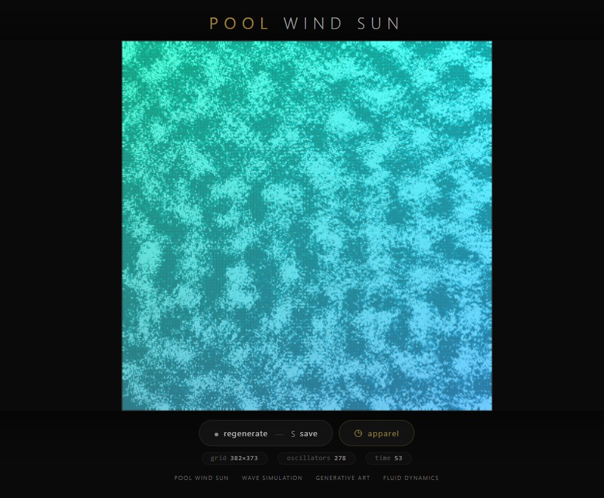
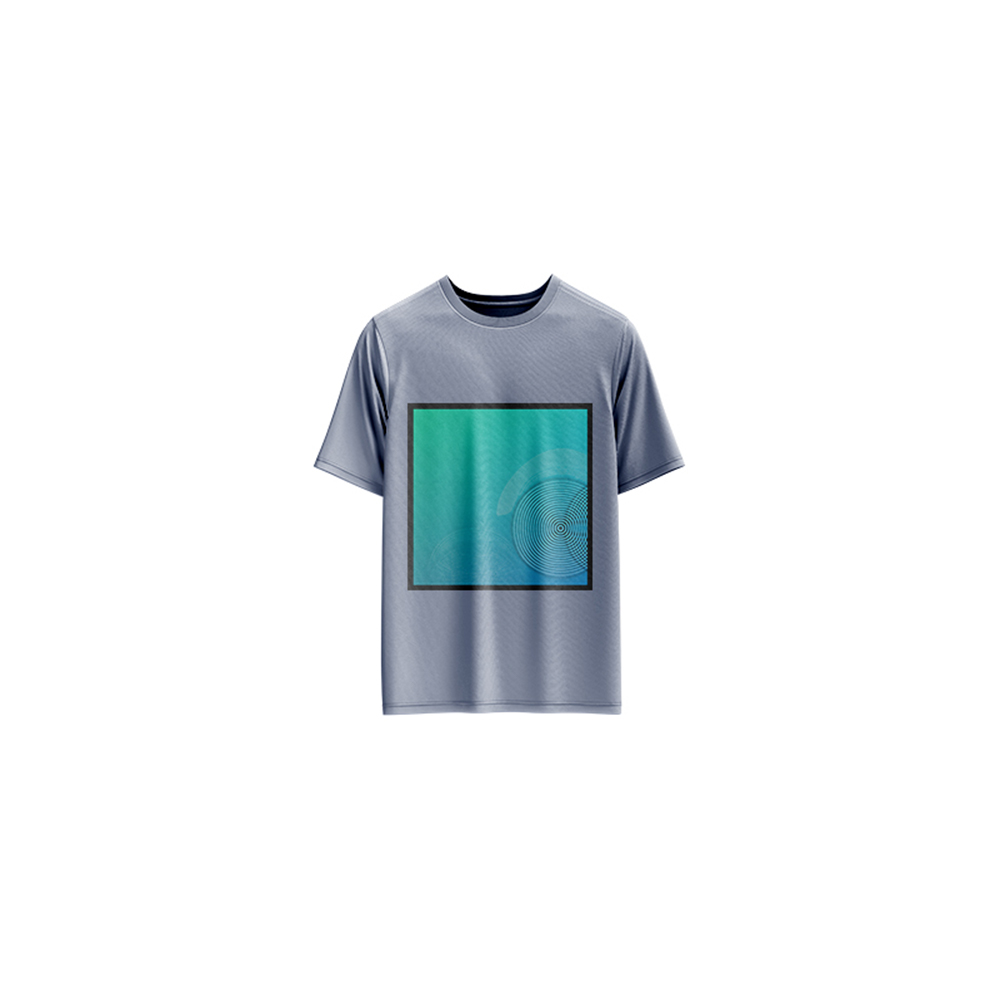

# Pool Wind Sun — Generative Art

[](https://reyrove.github.io/Pool-Wind-Sun-Generative-Art)
[](https://opensource.org/licenses/MIT)

> **Generative wave simulation art with fluid dynamics.** Each refresh creates a unique pool of rippling waves with oscillating patterns, resembling wind moving across water under sunlight.

## 🎨 Live Demo

<div align="center">
  <a href="https://reyrove.github.io/Pool-Wind-Sun-Generative-Art" target="_blank">
    
  </a>
  <br><br>
  <a href="https://reyrove.github.io/Pool-Wind-Sun-Generative-Art" target="_blank">
    
  </a>
  <br>
  <em>Click the image or button to experience the generative art</em>
</div>

## 👕 Apparel Preview

<div align="center">
  
  <br>
  <em>Pool Wind Sun artwork printed on a T-shirt</em>
</div>

## ✨ Features

- **Wave Simulation** — Physics-based fluid dynamics with oscillating patterns
- **Dynamic Grid** — 350-550 cell grid with random dimensions
- **Oscillating Points** — 1-380+ wave sources creating ripples
- **Gradient Colors** — Beautiful sunset-inspired color transitions
- **Variable Scale** — Random scaling creates unique compositions
- **Save & Share** — Download as PNG
- **Apparel Mode** — Preview artwork on a T-shirt mockup
- **Responsive** — Works on desktop, tablet, and mobile
- **Pure JavaScript** — Built without external libraries
- **Keyboard Shortcuts**:
  - `R` — Regenerate
  - `S` — Save image
  - `T` — Toggle apparel view
  - `Space` — Regenerate

## 🎨 Artwork Details

| Parameter | Range | Description |
|-----------|-------|-------------|
| **Grid Columns** | 350–400 | Horizontal resolution |
| **Grid Rows** | 340–390 | Vertical resolution |
| **Oscillators** | 1–380+ | Wave source points |
| **Wave Speed (c)** | Variable | Propagation speed |
| **Time Steps** | 30–70 | Simulation duration |
| **Scale Factor** | 0.75–1.0 | Canvas scaling |
| **Background** | 30–230 | Dark to light backgrounds |

## 🎯 Color Gradients

The artwork features dynamic gradient colors that shift based on wave amplitude:

| Position | Color Range |
|----------|-------------|
| **Top (Low amplitude)** | Deep blues (10-50, 180-255, 200-255) |
| **Bottom (High amplitude)** | Warm oranges and pinks (50-90, 200-255, 150-210) |
| **Wave Peaks** | Bright highlights (255, 255, 255) |
| **Wave Troughs** | Deeper, richer colors |

### Color Behavior
- Base colors shift from blue at the top to warm tones at the bottom
- Wave height adds brightness and reduces opacity
- Creates a sunset-over-water effect
- Alpha channel varies with wave amplitude for depth

## 🚀 Quick Start

### Local Development

```bash
# Clone the repository
git clone https://github.com/reyrove/Pool-Wind-Sun-Generative-Art.git

# Navigate to the directory
cd Pool-Wind-Sun-Generative-Art

# Open in browser
open index.html
# or use a live server
```

### Deploy to GitHub Pages

1. Push to GitHub
2. Go to Settings → Pages
3. Select branch `main` and root folder
4. Your site will be live at `https://reyrove.github.io/Pool-Wind-Sun-Generative-Art`

## 🧠 How It Works

The artwork simulates wave propagation using the 2D wave equation:

### Physics Simulation

1. **Wave Equation**: 
   ```
   ∂²u/∂t² = c²(∂²u/∂x² + ∂²u/∂y²)
   ```
   Where `u` is wave height, `c` is wave speed

2. **Numerical Method**:
   - Finite difference method on a 2D grid
   - Second-order accurate in space and time
   - Stable for given timestep `dt`

3. **Oscillators**:
   - Randomly placed point sources
   - Each oscillates at unique frequency
   - Creates interference patterns

4. **Boundary Conditions**:
   - Reflective boundaries
   - Waves bounce off edges
   - Creates complex standing wave patterns

### Color Mapping

- Wave height mapped to 0-1 range
- Gradient based on grid position (x,y)
- Amplitude adds brightness
- Alpha channel creates transparency effect

## 📁 File Structure

```
Pool-Wind-Sun-Generative-Art/
├── index.html          # Main application (all-in-one)
├── Pool-Wind-Sun.jpg   # T-shirt mockup image
├── fav.svg             # Favicon
├── demo-screenshot.jpg # Website demo screenshot
├── README.md           # This file
└── LICENSE             # MIT License
```

## 🛠️ Tech Stack

- **Pure JavaScript** — No external libraries
- **Canvas API** — 2D rendering with transparency
- **CSS Flexbox/Grid** — Responsive layout
- **GitHub Pages** — Hosting

## 🎯 Interactive Controls

| Action | Keyboard | Button |
|--------|----------|--------|
| Regenerate | `R` or `Space` | Click "regenerate" |
| Save Image | `S` | Click "regenerate" |
| Toggle Apparel | `T` | Click "apparel" |

## 🎨 The Creative Process

### Wave Physics
The artwork uses the 2D wave equation to simulate realistic wave propagation. Multiple oscillating point sources create interference patterns, mimicking wind rippling across a pool of water.

### Organic Patterns
Random oscillator placement and frequencies generate unique, organic wave patterns every time. The interference of multiple waves creates complex, beautiful ripple effects.

### Color Palette
The gradient color scheme transitions from cool blues at the top to warm oranges and pinks at the bottom, creating a sunset reflection effect on the water surface.

### Amplitude Mapping
Wave height is mapped to both color brightness and opacity, creating depth and dimensionality. Higher waves appear brighter and more opaque, while lower waves are softer and more transparent.

## 📱 Responsive Design

The application automatically adapts to:
- Desktop screens
- Tablets
- Mobile phones
- Landscape orientation
- Various aspect ratios
- Small screens (down to 380px wide)

## 🤝 Contributing

Contributions are welcome! Feel free to:
- Fork the repository
- Create a feature branch
- Submit a pull request

### Ideas for Contributions:
- Additional color palettes
- Different boundary conditions
- Animation features
- Interactive controls
- Performance optimizations
- More apparel mockups

## 📄 License

MIT License — see [LICENSE](LICENSE) file for details.

## 🙏 Acknowledgments

- Inspired by wave physics and fluid dynamics
- Named for the gentle interaction of pool, wind, and sun
- Special thanks to the creative coding community

---

**Built with ❤️ and wave dreams**